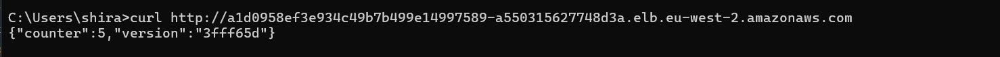
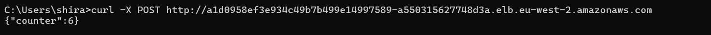
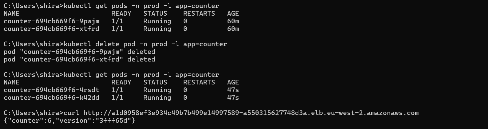

# counter-service - AWS EKS Deployment
This is a simple web server which counts the amount of POST requests it served, and return it on every GET request it gets


**Live URL**:
 `http://a1d0958ef3e934c49b7b499e14997589-a550315627748d3a.elb.eu-west-2.amazonaws.com`


---

## 📋 Project Overview

This project implements a production-ready counter service deployed on AWS EKS with:
- **Containerized Python Flask application** with metrics exposure
- **AWS EKS cluster** provisioned via Terraform 
- **Automated CI/CD pipeline** using AWS CodeBuild
- **High availability** with multi-replica deployment, HPA, and PodDisruptionBudget
- **Persistent storage** using AWS EFS across multiple availability zones
- **Observability** with Prometheus metrics and Grafana dashboards
- **Security hardening** with non-root containers and encrypted storage

---

## 🏗️ Architecture

```
GitHub → AWS CodeBuild → ECR → EKS Cluster (prod namespace)
                                    ↓
                         [Counter Pods (2-5 replicas)]
                                    ↓
                              EFS Storage
                                    ↓
                         LB (via NGINX Ingress)
                                    ↓
                          Prometheus + Grafana
```

**Infrastructure Components**:
- **VPC**: Multi-AZ (eu-west-2a, eu-west-2b) with public/private subnets
- **EKS Cluster**: Kubernetes 1.33, STANDARD update policy
- **EFS**: Encrypted shared storage for counter persistence
- **ECR**: Private Docker registry
- **CodeBuild**: Automated CI/CD pipeline
- **Monitoring**: kube-prometheus-stack (Prometheus + Grafana)

---

## 🚀 Provisioning the Cluster

### Prerequisites
- AWS CLI configured with credentials
- Terraform v1.5+
- kubectl v1.28+
- Helm v3.12+

### Step 1: Deploy Infrastructure

```bash
# Clone repository
git clone https://github.com/shirasss/counter-service.git
cd counter-service

# Deploy base infrastructure (VPC, EKS, EFS, ECR, CodeBuild)
cd Terraform/Infra
terraform init
terraform apply

# Expected time: 15-20 minutes
```

**Key Terraform Resources**:
- `vpc.tf`: Multi-AZ VPC with NAT gateways
- `eks.tf`: EKS cluster with STANDARD update policy
- `node-group.tf`: t3.medium worker nodes (2 min, 4 desired)
- `efs.tf`: Encrypted EFS with mount targets in each AZ
- `ecr.tf`: Private ECR repository
- `codebuild.tf`: CI/CD pipeline project

### Step 2: Configure kubectl

```bash
aws eks update-kubeconfig --name counter-eks-cluster --region eu-west-2
kubectl get nodes
```

### Step 3: Deploy Cluster Configurations - NGINX + prometheus-stack (Prometheus + Grafana)

```bash
cd ../eks-config
terraform init
terraform apply
```

---

## 🔐 Credentials & Secrets Management

- **CodeBuild**: Uses IAM service role with permissions for ECR, EKS, CloudWatch
- **EKS Nodes**: IAM role with policies for ECR pull, EFS mount, CloudWatch logs
- **Terraform Backend**: S3 bucket + DynamoDB for state locking
- **EFS Access**: Mounted via CSI driver with security group rules

---

## 🔄 CI/CD Pipeline

### Pipeline Configuration

**File**: [`buildspec.yml`](buildspec.yml)

**Trigger**: Automatic on push to `main` branch (via GitHub webhook)

**Phases**:
1. **Pre-build**: Login to ECR, set IMAGE_TAG from git commit SHA
2. **Build**: Build Docker image from Dockerfile
3. **Post-build**: Push image to ECR, update EKS  helm deployment

---

## 📦 Deployment

### Helm Chart Structure

```
helm/
├── Chart.yaml              # Chart metadata
├── values.yaml             # Configuration (image, replicas, resources)
└── templates/
    ├── deployment.yaml     # Counter application pods
    ├── service.yaml        # ClusterIP service
    ├── ingress.yaml        # NGINX ingress (external access)
    ├── hpa.yaml            # Horizontal Pod Autoscaler
    ├── pdb.yaml            # Pod Disruption Budget
    ├── pvc.yaml            # Persistent Volume Claim
    ├── pv.yaml             # Persistent Volume (EFS)
    └── service-monitor.yaml # Prometheus metrics scraping
```
---

## Functionality & Persistence Verification

### Get current counter value



### Post request to increase the counter value



### Delete all pods and see that the counter value persisted !




## 📊 Observability

### Metrics (Prometheus)

**Exposed Metrics**:
- `counter_post_requests_total`: Total POST requests received
- `counter_get_requests_total`: Total GET requests received
- Standard Python/Flask metrics (CPU, memory, GC)


### Grafana Dashboard

**Access Grafana**:
```bash
http://a1d0958ef3e934c49b7b499e14997589-a550315627748d3a.elb.eu-west-2.amazonaws.com/grafana
```


## 🚀 Improvements Made

### Application Enhancements
- ✅ Added Prometheus metrics (`counter_post_requests_total`, `counter_get_requests_total`)
- ✅ Health check endpoint (`/healthz`)
- ✅ Version tag in response (git commit SHA)

### Infrastructure Enhancements
- ✅ Multi-AZ deployment for resilience
- ✅ Encrypted storage (EFS, EBS)
- ✅ Private subnets for nodes
- ✅ Monitoring stack (Prometheus + Grafana)

### Operational Enhancements
- ✅ Helm for easy rollbacks
- ✅ HPA for automatic scaling under load
- ✅ PDB for zero-downtime maintenance
- ✅ Resource requests/limits for stability
